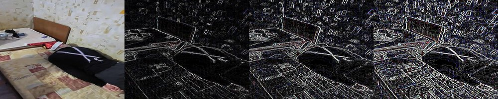

# Convol — tool for BMP image filtering.

**Сonvol** provides a set of different (in terms of parallelism) image convolutions algorithms.

## Effects
**Convol** have 4 different filters with the ability to adjust the strength of the effect.

- Emboss

- Blur

- Motion Blur

- Find edges


## Installation

```bash
# Clone project
git clone https://github.com/suvorovrain/Convol.git && cd Convol

# Build
make build
```

## Usage
### Single image mode
```
Usage: ./build/convol <src_image> <effect> <strength> <dest> <algo_type> <proc_type>
```
*src_image:* One or more source `.bmp` file

*Effects:* Possible values: `blur`,`motion_blur`,`find_edges`,`emboss`

*Strength of effect:* Possible values: `1`,`2`,`3`

*Destination:* Path to save result images

*Algorithm type:* Possible values: `linear`,`parallel_pixel`,`parallel_row`,`parallel_column`

*Processing type:* Type of approach array of images processing. Possible values: `classic`, `queue` (default: `classic`)

**Examples:**
```
# simple usage
./build/convol image-examples/hmk.bmp find_edges 3 image-results/ parallel_pixel

# few images using *
./build/convol image-examples/*.bmp find_edges 3 image-results/ linear classic

# few images using space as a delimiter
./build/convol image-examples/hmk.bmp image-examples/silly.bmp emboss 1 image-results/ parallel_row queue

# you can skip <proc_type> argument
```


## Tests

For running tests do:
```
make test
```
## Benchmarks
Benchmark results are located in a [corresponding](./bench/) folder