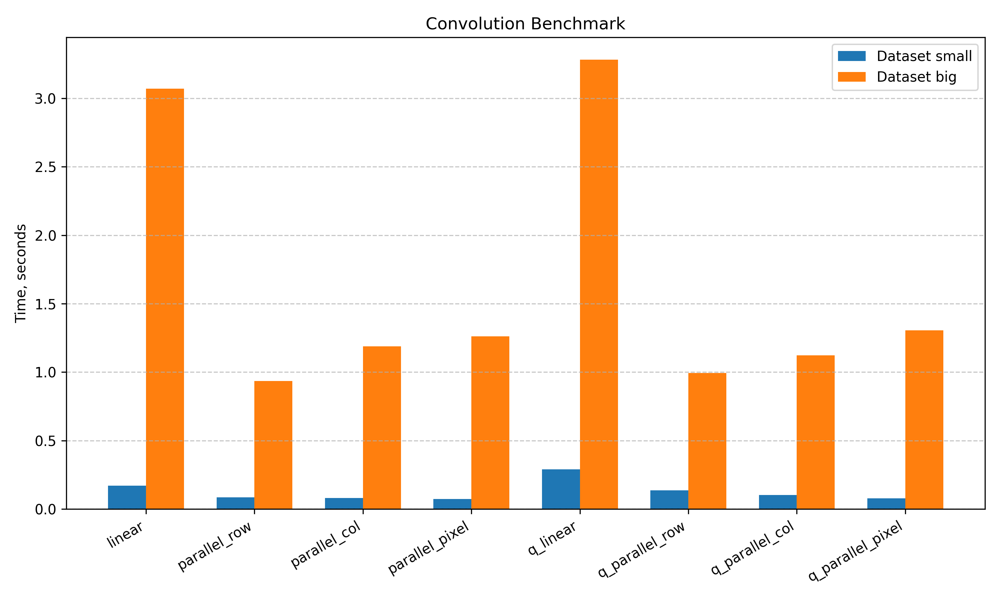
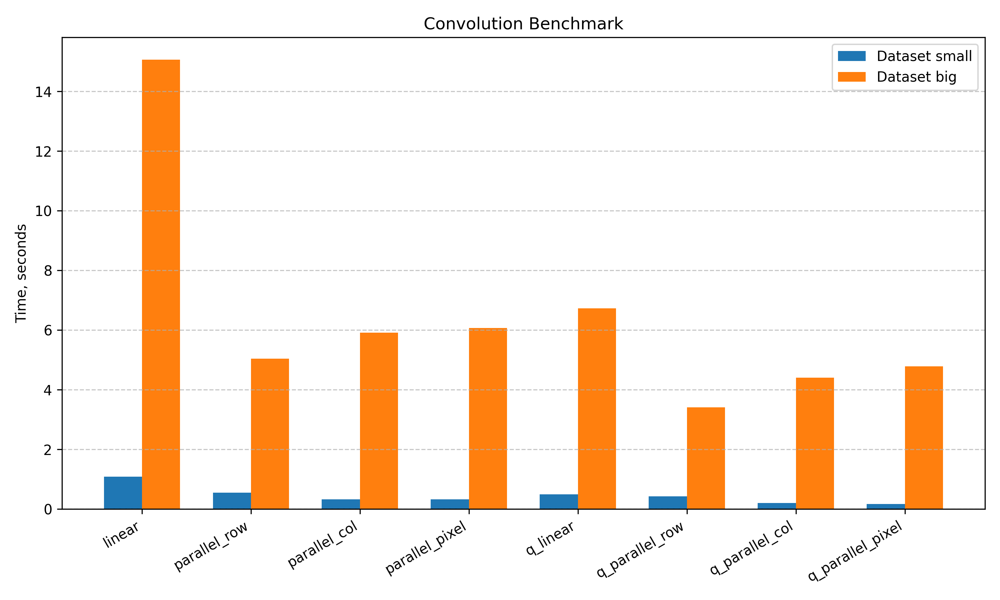

# Benchmark Results
**System parameters**:
- Kubuntu 24.04.2 
- 12th Gen Intel i7-12700H 20cpus
- 16GB RAM

**Queue parameters**:
- Nubmer of readers: 5
- Number of workers: 10
- Number of writers: 5

## Single image convolution

- The [hmk.bmp](../image-examples/small/hmk.bmp) file was selected as the small image.

    - **Small image size**: 720x1080

- The [nmjk.bmp](../image-examples/big/nmjk.bmp) file was selected as the big image.

    -   **Big image size**: 3680x3680

| Algorithm type        | Small img. | Big img. |
|--------------------|-----------|-----------------|
| linear             | 0.171612  | 3.070656        |
| parallel_row       | 0.086495  | 0.936173        |
| parallel_col       | 0.079817  | 1.187789        |
| parallel_pixel     | 0.074895  | 1.261801        |
| q_linear           | 0.289809  | 3.281047        |
| q_parallel_row     | 0.136576  | 0.993710        |
| q_parallel_col     | 0.102661  | 1.123104        |
| q_parallel_pixel   | 0.077647  | 1.306543        |

Results are demonstrated in a plot below:  

We can make following conclusions:
- The best performance is achieved with row-wise parallelism

- Using a queue for processing a single image is slower due to the overhead

- Parallel processing enables a significant speedup of image convolution (up to 3x)

---

## Stream convolution

- Source images for small images array located in `./image-examples/small`
- Source images for big images array located in `./image-examples/big`

| Algorithm type         | Small img. array | Big img. array  |
|--------------------|-----------|-----------------|
| linear             | 1.091843  | 15.060122       |
| parallel_row       | 0.545764  | 5.047227        |
| parallel_col       | 0.327905  | 5.915646        |
| parallel_pixel     | 0.328934  | 6.074496        |
| q_linear           | 0.496147  | 6.725678        |
| q_parallel_row     | 0.426027  | 3.414878        |
| q_parallel_col     | 0.204738  | 4.402052        |
| q_parallel_pixel   | 0.169712  | 4.789811        |

Results are demonstrated in a plot below:    

We can make following conclusions:
- In the case of processing array of images, using a queue is the most efficient approach.
- The simple linear approach becomes highly inefficient on large images due to the high cost of memory read/write operation